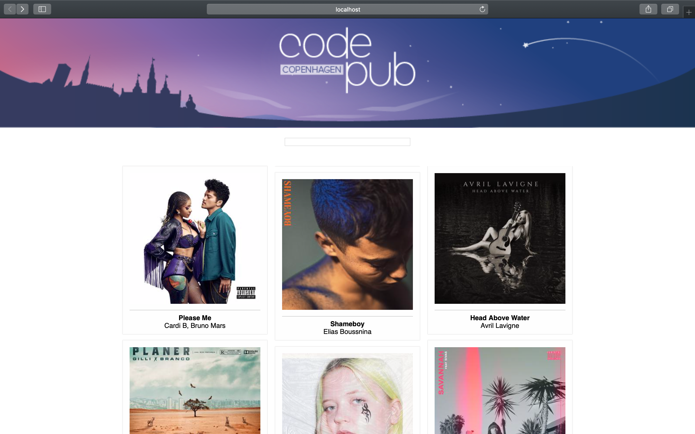

This project was bootstrapped with [Create React App](https://github.com/facebook/create-react-app).

# React Workshop

To save time I recommend completing this workshop in CodeSandbox, unless you already have everything you need installed on your laptop including Git, Node/npm and your favourite text editor. 

## Complete the workshop on CodeSandbox

Navigate to https://codesandbox.io/s/github/kristinaolsson10/code-pub-react-workshop and get started instantly. When you save a change a fork of the original sandbox will automatically be created so that you get your own copy to work on. 

   💡 You might want to consider copying the url to your own fork and saving it somewhere so it's easy to find again.

## Complete the workshop on you own PC

### Prerequisites

- To use this application you need to install Git and Node.js + NPM on your local machine.
- You will also need a text editor, such as Visual Studio Code.

#### Install Git
- https://git-scm.com/book/en/v2/Getting-Started-Installing-Git

#### Install Node
Npm is distributed with Node.js
- https://www.npmjs.com/get-npm

### Get the code

In your terminal, navigate to/create a directory where you want to download the source code.
- Run `git clone https://github.com/kristinaolsson10/code-pub-react-workshop.git`

In your terminal, navigate to the project directory. Once there you can run:

`npm install` followed by `npm start`

Runs the app in the development mode.<br>
Open [http://localhost:3000](http://localhost:3000) to view it in the browser.

The page will reload automatically if you make code changes.<br>
You will also be able to see any lint errors in the console.

## Workshop

This is what we're building:



Look for comments in the code for hints on how to implement the following.

1. Add the `AlbumCard` component to the app
   1. Import the `AlbumCard` component
   1. Add the `AlbumCard` component

1. Use real data from Spotify to get album list
    1. Fetch album data into the state in  CompnentDidMount in App.js
    1. The app should now be able to print several AlbumCard components

1. Make the `AlbumCard` component show something more meaningful
   1. Print image, album name and the name of the artists

   💡 Have a look at spotify-new-releases.json file to see what data is available. You access the data from the album prop that you sent in, for example: ```album.images[1].url``` will get you the url for an appropriate album cover image. To print the name of all artists you need to loop the ```album.artists``` array. You can use the map function to do that `album.artists.map((artist, index) => {})`.

1. Make it look awesome ✨

   1. Beautify the album list container
   1. Beautify the album card
   1. Beautify the album cover image

   💡 Use the styles we have imported for you

1. Create your own component called `AlbumDetails` visible when you've clicked an album in the list
    1. Create the new component
    1. Display for example title, image and a link to open the album in Spotify (album.external_urls.spotify in the json)
    1. Complete the handleAlbumClick function and send it into the AlbumCard and use it in an onClick event
    1. Import `AlbumDetails` in App.js and adapt the render function to display AlbumDetails when an album has been selected

1. Ideas for continuing on your own
    1. How could you use this album list to create your own playlist with only the albums that you want?
    1. 

## Learn more

- [style](https://reactjs.org/docs/faq-styling.html)
- [map function](https://developer.mozilla.org/en-US/docs/Web/JavaScript/Reference/Global_Objects/Array/map)
- {} → [curly braces](https://stackoverflow.com/questions/43904825/what-do-curly-braces-mean-in-jsx-react)
- <> → [JSX](https://reactjs.org/docs/introducing-jsx.html)
- [passing functions](https://reactjs.org/docs/faq-functions.html)
- [state](https://reactjs.org/docs/faq-state.html)
- [json files](https://fileinfo.com/extension/json)
